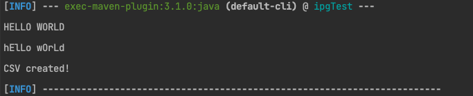
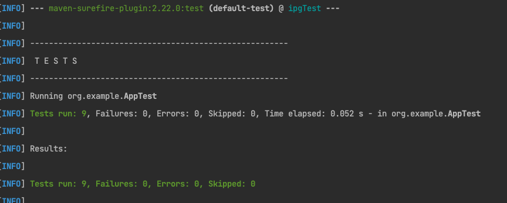

## iPriceGroup Assesment

### Project Info
| Project Name  | iPriceGroup      |
|---------------|------------------|
| IDE           | intelliJ Idea    |
| Project Type  | Maven            |
| Java Version  | 1.8              |
| Maven Version | 3.8.5            |
| Dependency    | JUnit 5  (5.9.0) |


### Instruction
1. clone the project: ```git clone https://github.com/SanowerTamjit/ipgTest.git```
2. Install the maven dependencies  ```mvn clean install```
3. After successfully compilation of maven the main class can be run by ```mvn exec:java -Dexec.mainClass="org.example.App" -Dexec.args="'<string>' '<filename>'" ```
   <br> After running the command the expected output : <br>
4. The CSV will be generated in the root dir(./)
5. And for the Unit Test please run ```mvn test``` <br> After running the command the expected output : <br>
   <br><br>
*Make sure that all commands(2-4) running from the root directory
***
